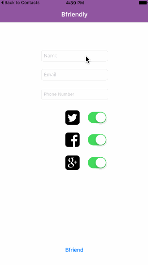

  

  <b>
    Add someone into your address book and on social networks all at once
  </b>

   
   

  

 

## Why
Adding someone on multiple social networks is a hassle. In the digital age there are so many different social media sites, and it's always increasing.

 

  <b>Reduce the overhead of using more than one social network</b>

 

Copyright 2015 Dawson Botsford
