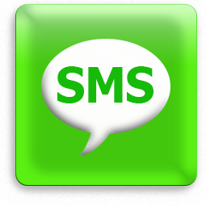
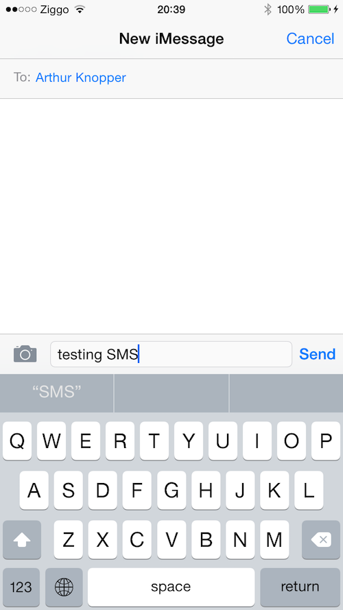

  

  <b>
    When you want to give someone the casual message that  it's just a casual message,  use casual message
  </b>

   
   
  

 

## Why
Cell phone numbers are publicly available and easily shareable. People shouldn't be able to contact you freely and as often as they want and sometimes you need to give that person vibes to back off. CasualMessage makes this process a breeze by allowing you to

 

  <b>Respond immediatly to a text but really have it send out at a later time randomly chosen by the app</b>.

 

Use it to give someone else the vibe casually that you are not interested in continuing a conversation.

 
## What
CasualMessage is an iOS app written in Swift. It's a client which sits on-top-of your SMS system so that you are able to send and receive texts very much like you are used to, but with the "middle-manning" of CasualMessage. You can select a time and using the server we have provided with node.js, your message will be sent out at a later time.

 
Below is a screenshot of the MVP, and in actuality, CasualMessage will have an extra option at the top which allows for a configurable delay on the message (you can also send it with no delay to text as one normally would).

 
 

  

